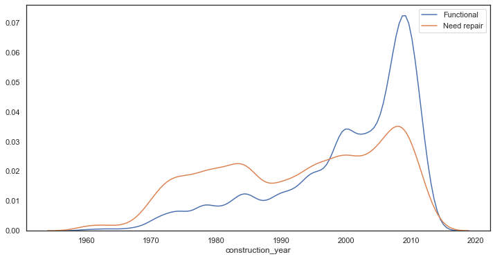
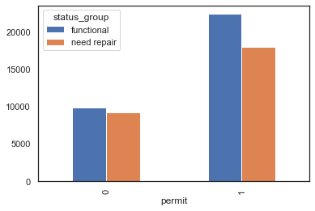

# Tanzania Water Well Classification
####  Wayne Wooyoung Hong

## Structure:
- 1.Data_Cleaning.ipynb
- 2.EDA.iypnb
- 3.Modeling.ipynb

### About dataset:
Data was from DrivenData.org competition which was taken from  Tanzanian Ministry of Water and this is dataset about water wells in Tanzania. 

### What is the problem?
In Tanzania, about 57% of the 57 million people of population have access to clean water and many have to travel for a long time to be able to get water. (water.org). Around 16% of the population do not have access to water to clean their hands regularly. In the pandemic we are currently living in, this is a huge problem as many diseases including covid which can be transmitted if people do not constantly wash themselves. Not only that, but also about 17% of the population are using bathroom outside on a field, or forest. This also creates a problem as people gather around rivers, ponds, and other sources of water to drink and the feces may go into their water source. Therefore, waterpoints are crucial for Tanzanians well-being so that they have access to clean source of water. By running models to find best model and comparing recall scores and f1 scores, we can help minimize false negatives (when well is stated as functional when it is in need of repair) to help the Tanzanians from going long distance to a broken well point. Also, I find that f1 score is also of second importance because Tanzania is developing country and do not have alot of money to fix wells that are actually fine.

### Data Cleaning:
While going through the dataset, I found out that there were 59400 observations and 40 different columns. I found out that there were some missing values. 

### Exploratory Data Analaysis:
Below I will show EDA process and insights:

#### Target:  Water Well Status Group:
Target variable for this dataset was status of the water point. It originally had three classes, but I switched it to binary classification because I believed that non functional also may need repair and wanted to show that the wellpoint are either functional or need repairs.

#### Predictors: 
There were 39 predictors in this dataset, but I had found out through EDA and seeing the unique values of the columns to drop as they were repetitive or there was no importance.

##### Year of Construction:

Here we can notice that the graph shows that the more recent year that the well was constructed, it is still functional. We can notice its relationship to the year it was built and it is likely to be functioning. 

###### Permit:

Upon seeing this column, I was curious on how having a permit or not would make an impact to its status group. Here, we can see that there are more waterpoints with permit than no permit. This is probably because there is some regulation or maintenance to keep permit for the well point. We can note that there isn't a really clear relationship so I went further to do a hypothesis test to see if this has any significance. Using two sample z test for proptions, I was able to find that it is significant as the test statistic is in the rejection region. 

###### Payment

From this graph, we can clearly see that if not paying, there are alot more well points that need repairs. This is probably due to the fact that because there are no money coming in, there is less concerns about the wellpoints that do not require payment(maintenance). 

### Model Evaluations:
#### Evaluation:
After comparing Logistic Regression, KNN, Decision Tree, Random Forest, and Voting Classifier, I was able to determine that Random Forest gave me the best recall score and second best F1 score.  I chose this model because the importance of recall to minimize the false positive as that will make the organizations who are going to well points to repair may find out once they get there that there is nothing to fix. This would be a high cost.

### Conclusion:
#### Post Model Predicting with Final Dataset:

As you can see from the confusion matrix, the false negatives are quite small. This means that I was able to optimize the recall score of 0.985. However, this brought my false positives up which also means it lowered my precision score. Thus, lowering type II error made my Type I error high. In my case, this is acceptable as having a lower false negative and increasing recall score was the goal since false negative which was that water well not needing repair but it did. This would allow the organizations to not waste money to travel to fix the well points that did not needed to be fixed.

